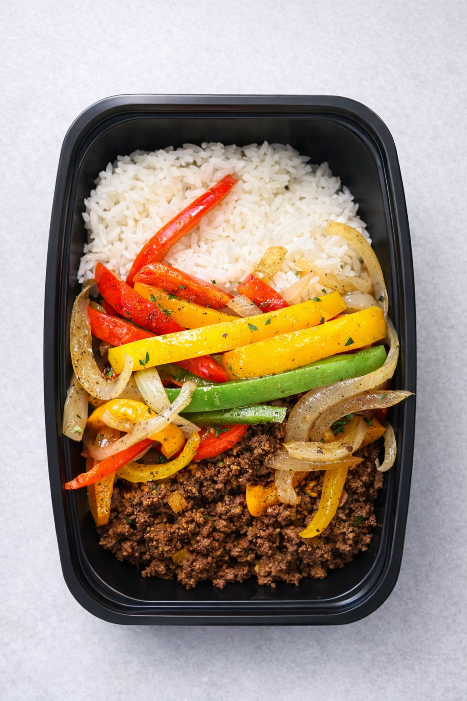

Utah County's Performance Meal Prep

# Eat Like You Train.

130+ fresh meals prepped every week for people who actually show up. Hit your protein. Skip the cooking. Stay consistent.

[See Plans →](/subscribe/)
[This Week's Menu](https://menu.gainztrainprep.com)

130+
Meals / Week

$8.50
Starting / Meal

Sun
Pickup Day

High Protein
Fresh Every Week
From $8.50 / Meal
Never Frozen
Utah County
Macro Transparent
Sunday Pickup
Built for the Gym
High Protein
Fresh Every Week
From $8.50 / Meal
Never Frozen
Utah County
Macro Transparent
Sunday Pickup
Built for the Gym

130+
Meals Every Week

Not a side project. A real system, prepped fresh every Saturday in Utah County.

$8.50
Starting Per Meal

Factor charges $11–15. Trifecta $13+. You get the same macros, fresher food, no shipping.

40g+
Protein Per Meal

Every meal is built around protein first. Know exactly what you're eating every single day.

1 Day
Freshness Window

Prepped Saturday. In your hands Sunday. Not frozen, not shipped across the country.

“

“Down 18 lbs in 3 months. I finally stopped eating out every night. Knowing my meals are ready every Sunday is the only reason I stayed consistent.”

✓ Down 18 lbs

Jake M.

Athlete Plan • 12 meals/week

The Difference

## Built for Performance. Not a Diet Trend.

Every decision we make is built around one thing: helping you hit your goals without adding friction to your week. No wellness speak. No frozen boxes. Just real food that works.

#### High Protein, Every Meal

Protein first, always. No fillers, no fluff. Every meal is engineered around what actually moves the needle in the gym.

#### Macro Transparent

Exact protein, carbs, fat, and calories on every meal. Track with confidence. No more guessing what's actually in your food.

#### 30–50% Less Than Factor

From $8.50/meal vs. $11–15 nationally. Same macros, fresher prep, zero shipping cost. Local always wins.

#### New Menu Every Week

You pick exactly what you want from a rotating weekly menu. We cook Saturday. You pick up Sunday. Simple.

The Menu

## Food That Actually Tastes Good.

Brotatoe Bowl

**38g** Protein
**45g** Carbs
**10g** Fat
**418** Cal

Grilled Chicken & Rice

Chicken & Asparagus

[See Full Meal Catalog →](/meals/)

The Process

## How It Works.

Simpler than cooking. Cheaper than eating out. Better than frozen.

1
Step 01

#### Pick Your Plan

Choose 6–16 meals/week based on your goals. Starter, Athlete, or Elite — all flexible, cancel anytime.

2
Step 02

#### Choose Your Meals

Every week, browse the rotating menu at menu.gainztrainprep.com and lock in your picks before Friday cutoff.

3
Step 03

#### We Prep Saturday

Fresh, never frozen. Portioned to your goal — Cut, Maintain, or Build. Prepped in a commercial kitchen.

4
Step 04

#### Pick Up & Fuel

Sunday pickup or delivery in Utah County. Your week of food handled. Go train.

Our Story

## Built by Guys Who Actually Train.

We were tired of eating dry chicken out of a Ziploc bag or spending $14 on a frozen meal that tasted like cardboard.

Jayson has been prepping his own meals for 4 years — counting macros, training hard, figuring out what actually works. He built this system for himself first. Now it feeds 130+ people every week in Utah County.

[Meet the Team →](/about/)

🔥

### Try Your First Week — Risk Free.

Not happy with your first week? We'll make it right. No hoops, no headaches. We stand behind every meal we prep.

[Get Started →](/subscribe/)

Ready to Board?

## Stop Guessing. Start Fueling.

Pick your plan, choose your meals, and show up to Sunday pickup ready to win your week.

[See All Plans →](/subscribe/)
[How It Works](/how-it-works/)
