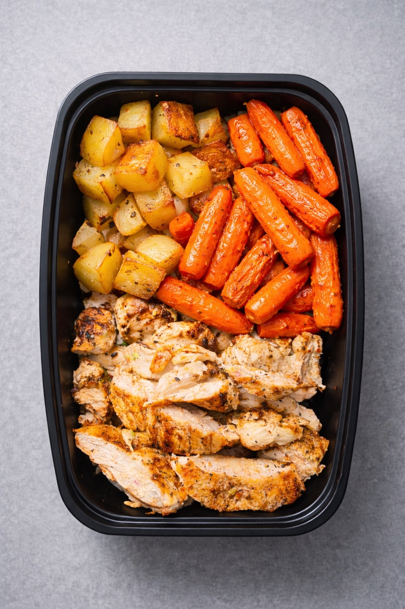
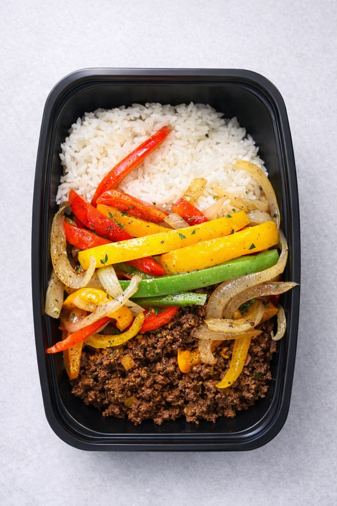
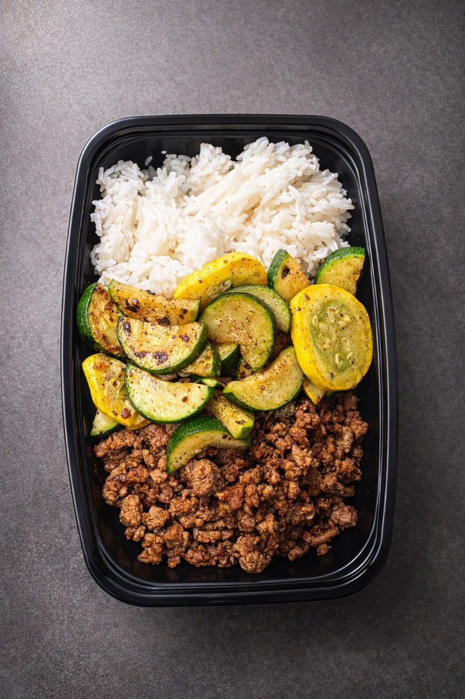
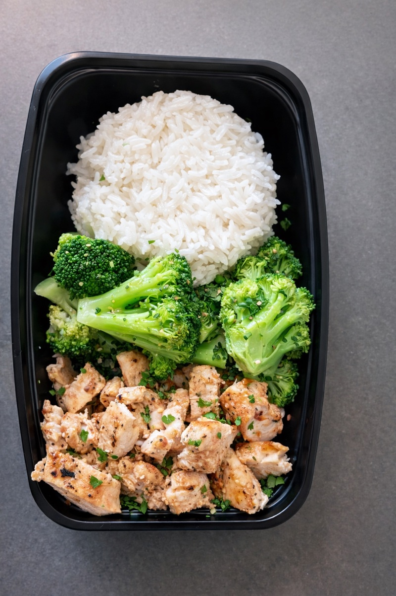

The Catalog

# Real Food. Real Macros.

High protein doesn't mean boring. Our rotating menu keeps things fresh every week. Below is the meal catalog — what you choose from changes weekly at menu.gainztrainprep.com.

High Protein
Fresh Every Week
From $8.50 / Meal
Never Frozen
Utah County
Macro Transparent
Sunday Pickup
Built for the Gym

### Want to See This Week's Menu?

The catalog below shows all meals we rotate through. To see what's available this week and make your selections, head to the weekly menu tool.

[This Week's Menu →](https://menu.gainztrainprep.com)

Chicken Bro-Tato Bowl

55g Protein

29g Carbs

24g Fat

520 Cal

Beef Fajita Bowl

45g Protein

45g Carbs

18g Fat

520 Cal

Teriyaki Turkey Bowl

42g Protein

58g Carbs

14g Fat

480 Cal

Chicken Broccoli & Rice

56g Protein

45g Carbs

10g Fat

490 Cal

Weekly Rotation

### The Menu Changes Every Week.

This catalog shows the meals we rotate through. What's available each week varies — that's what keeps it fresh and stops you from getting bored. Pick your meals each week before the Friday cutoff.

[See This Week's Menu →](https://menu.gainztrainprep.com)

Ready?

## Ready to Fuel Up?

Pick your plan and start eating meals that actually move the needle.

[Choose Your Plan →](/subscribe/)
[How It Works](/how-it-works/)
